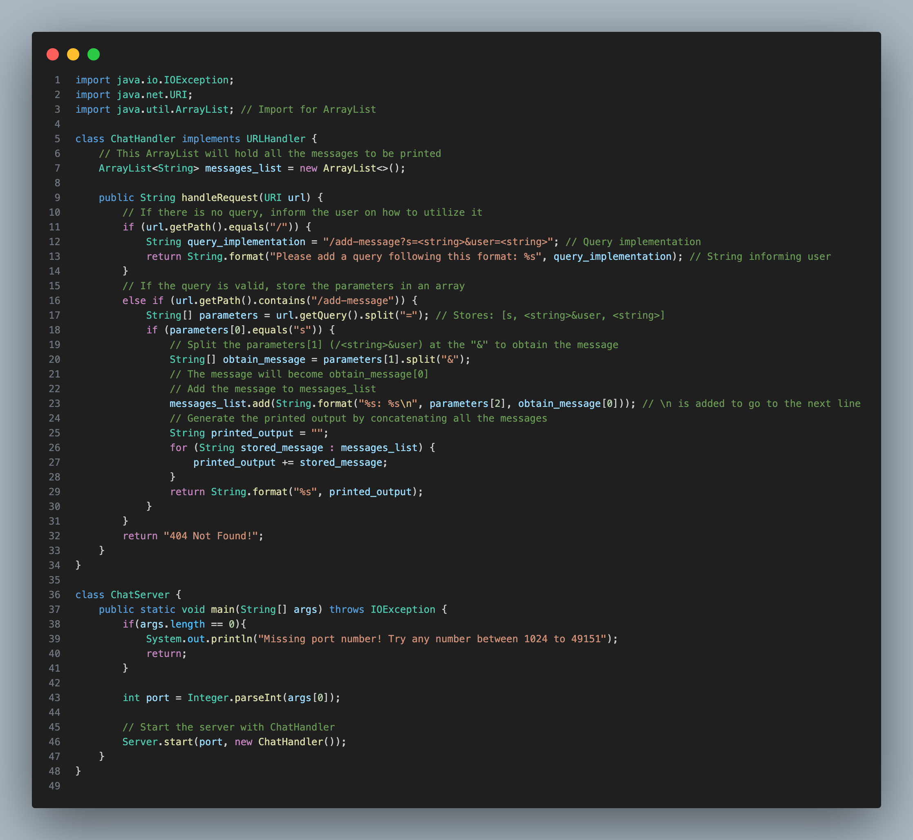
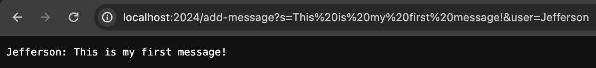

# Lab Report 2
### Jefferson Umanzor

---

### `ChatServer.java` Code

### Messages Query Showcase
*Screenshot 1*

- In this screenshot, I entered the URL: `http://localhost:2024/add-message?s=This is my first message!&user=Jefferson`.
- The `handleRequest` method then runs and takes the URL as a parameter. The method encounters an `if statement` that calls the `getPath()` method and the String class' `equals()` method to determine whether the URL's path is empty. The following `else if` statement calls the `getPath()` method and the String class' `equals()` method to obtain the current path and then calls the String class' `contains()` method 

<!--
Which methods in your code are called?
What are the relevant arguments to those methods, and the values of any relevant fields of the class?
How do the values of any relevant fields of the class change from this specific request? If no values got changed, explain why.

By values, we mean specific Strings, ints, URIs, and so on. "abc" is a value, 456 is a value, new URI("http://...") is a value, and so on.)
-->

<!--

-->
