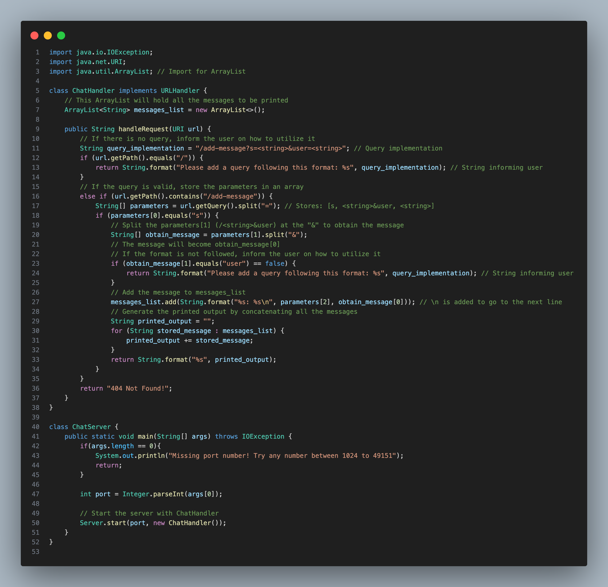
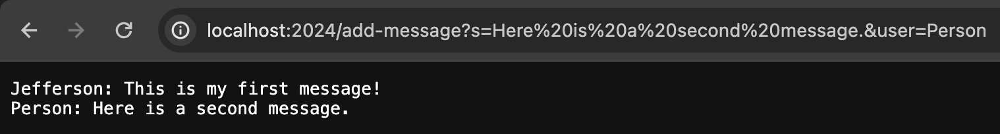

<!--
  Lab Report 2 for CSE 15L
  Winter 2023 Quarter
-->

# Lab Report 2
### Jefferson Umanzor

---

### `ChatServer.java` Code

## Messages Query Showcase

*Screenshot 1*

- In this screenshot, I entered the URL: `http://localhost:2024/add-message?s=This is my first message!&user=Jefferson`.
- The `handleRequest` method then runs and takes the URL as an argument. The method encounters an `if statement` that calls the `getPath()` method and the String class' `equals()` method to determine whether the URL's path is empty.
- The following `else if` statement calls the `getPath()` method and the String class' `equals()` method to obtain the current path and then calls the String class' `contains()` method with the path `"/add-message"` to determine if the proper path was passed.
- The URL query is then split using the String class' `equals()` method, utilizing the `=` argument. It is held within the String array `parameters`, separating the query received from `getQuery()` into `[s, <string>&user, <string>]`.
- The String class' `equals()` method is called once more to determine if `parameters[0]` is equal to `s`. If so, `parameters[1]`, `[<string>&user]`, is split using the String class' `equals()` method with the argument `&`. Thus, the String array `obtain_message` holds `[<string>, user]`.
- The outputted message is then added to the ArrayList `messages_list`, which contains all the messages, using the ArrayList class' `add()` method with the message passed as an argument. The message is derived using the String class' `format()` method, taking `parameters[2]`, the User, and `obtain_message[0]`, the message, as arguments, formatting them in the form `"%s: %s\n"`.
  - The ArrayList `messages_list` will add a new message in the format `<user>: <string>` each time a valid use of the `/add-message` is called. Restarting the server will cause the ArrayList `messages_list` to become empty. In this case, since `/add-message` is only validly called once, `messages_list` only contains one String.
- A String named `printed_output` is then created and runs through a `for loop` to concatenate each String, or `stored_message`, held within `messages_list`.
- Lastly, the printed output is returned using the String class' `format()` method, with the argument `printed_output`, formatting the message as `%s`.

*Screenshot 2*

- In this screenshot, I entered the URL: `http://localhost:2024/add-message?s=Here is a second message.&user=Person`.
- The `handleRequest` method then runs and takes the URL as an argument. The method encounters an `if statement` that calls the `getPath()` method and the String class' `equals()` method to determine whether the URL's path is empty.
- The following `else if` statement calls the `getPath()` method and the String class' `equals()` method to obtain the current path and then calls the String class' `contains()` method with the path `"/add-message"` to determine if the proper path was passed.
- The URL query is then split using the String class' `equals()` method, utilizing the `=` argument. It is held within the String array `parameters`, separating the query received from `getQuery()` into `[s, <string>&user, <string>]`.
- The String class' `equals()` method is called once more to determine if `parameters[0]` is equal to `s`. If so, `parameters[1]`, `[<string>&user]`, is split using the String class' `equals()` method with the argument `&`. Thus, the String array `obtain_message` holds `[<string>, user]`.
- The outputted message is then added to the ArrayList `messages_list`, which contains all the messages, using the ArrayList class' `add()` method with the message passed as an argument. The message is derived using the String class' `format()` method, taking `parameters[2]`, the User, and `obtain_message[0]`, the message, as arguments, formatting them in the form `"%s: %s\n"`.
  - The ArrayList `messages_list` will add a new message in the format `<user>: <string>` each time a valid use of the `/add-message` is called. Restarting the server will cause the ArrayList `messages_list` to become empty. In this case, since `/add-message` has already been validly called once, and is now called validly again, `messages_list` contains both the previous String and the new String.
- A String named `printed_output` is then created and runs through a `for loop` to concatenate each String, or `stored_message`, held within `messages_list`.
- Lastly, the printed output is returned using the String class' `format()` method, with the argument `printed_output`, formatting the message as `%s`.

## keygen Showcase

*keygen Files*

- I am inside the path `/Users/user/.ssh/` in this image. Using `ls` inside the path displayed the names of my private and public keys for my ieng login: `id_rsa` and `id_rsa.pub`. The absolute paths of each are `/Users/user/.ssh/id_rsa` and `/Users/user/.ssh/id_rsa.pub`.
- 

- I am inside the path `/home/linux/ieng6/oce/18/618/jumanzorurrutia/.ssh` in this image. Using the `ls` inside the path displayed the names of my private and public keys for my ieng login: `id_rsa` and `id_rsa.pub`. The absolute paths of each are `/home/linux/ieng6/oce/18/618/jumanzorurrutia/.ssh/id_rsa` and `/home/linux/ieng6/oce/18/618/jumanzorurrutia/.ssh/id_rsa.pub`. `ls` also displayed the file `authorized_keys`, which contains a copy of the public `ssh` key. Its absolute path is `/home/linux/ieng6/oce/18/618/jumanzorurrutia/.ssh/authorized_keys`.

*Login Showcase*

- I am not prompted for a password when I utilize my keygen and `ssh` into ieng6.

### Takeaways

- In the labs for weeks 2 and 3, I learned about keygens and ssh-ing. I believe that being able to `ssh` is a very powerful tool in the world of software, and being able to `ssh` without being prompted for a password due to a `keygen` is very convenient. In week 3, I also learned about Java web servers and was able to create a simple chat server.
