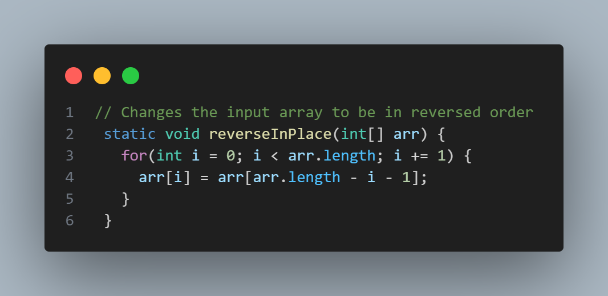
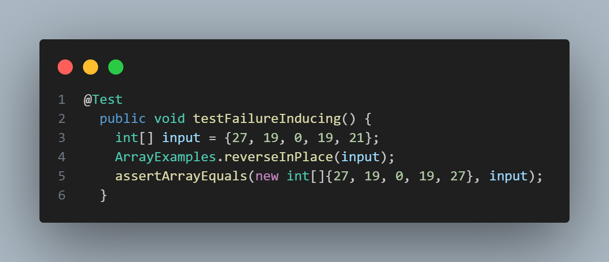
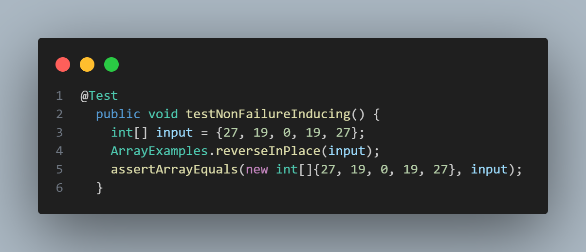
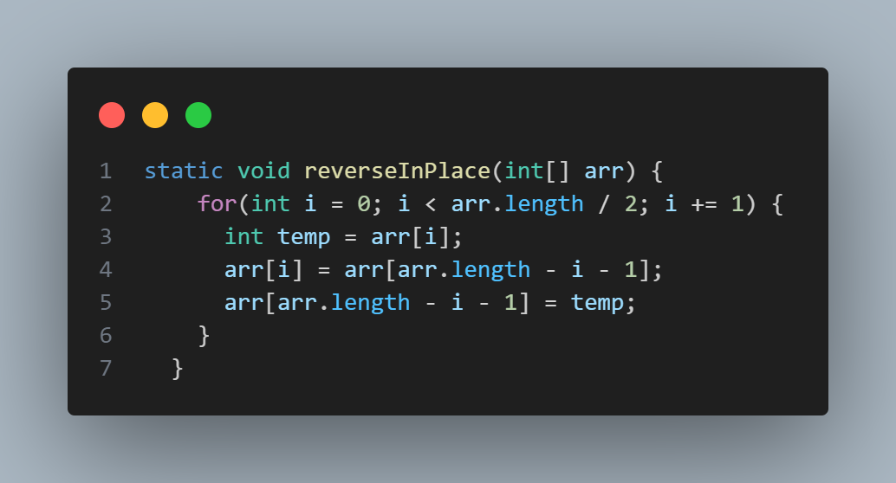
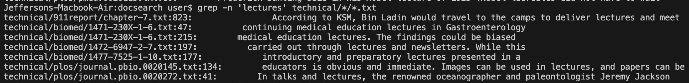
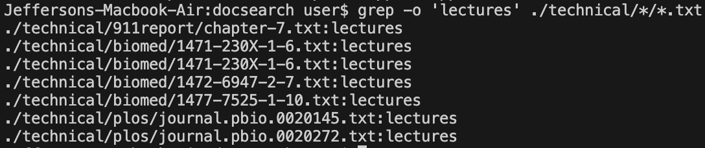
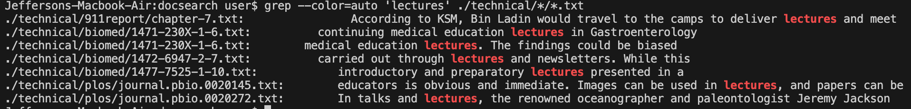
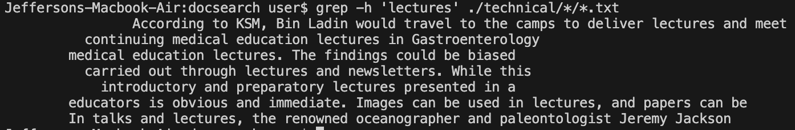

<!--
  Lab Report 3 for CSE 15L
  Winter 2023 Quarter
-->

<!-- michael, neeraj, nathan 
CSE 193 CSE 199/199H
CSE 197-->

# Lab Report 3
### Jefferson Umanzor

---

## Part One: Bugs

### Buggy Code

*Unchanged Buggy Code*

<!---->
```
// Changes the input array to be in reversed order
static void reverseInPlace(int[] arr) {
  for (int i = 0; i < arr.length; i++) {
    arr[i] = arr[arr.length - i - 1];
  }
}
```
- The method above, `reverseInPlace`, intends to reverse the input `int[]` array in-place, i.e., without creating a new `int[]` array.
- The method traverses through the entire array using a `for` loop and replaces each index with its mirrored index.
- This causes a bug in the code, represented as such:
  -  Each index in the first half of the array is set to its mirrored index in the second half of the array and is consequently overwritten.
  -  Each index in the second half of the array is set to its mirrored index in the first half of the array. As the values in the first half of the array are now overwritten, the second half of the array remains unchanged.
  -  Thus, the code results in the second half of the array being mirrored onto the first half.

### Test Cases for Buggy Code

*Failure Inducing Input*

<!---->
```
@Test
  public void testFailureInducing() {
    int[] input = {27, 19, 0, 19, 21};
    ArrayExamples.reverseInPlace(input);
    assertArrayEquals(new int[]{21, 19, 0, 19, 27}, input);
  }
```
- The code above displays a JUnit test for the buggy `reverseInPlace` method.
- This is a failure-inducing test, which will showcase the bug in the method.
- The method, `testFailureInducing` creates an `int[]` array `input` with the values `[27, 19, 0, 19, 21]` and calls `reverseInPlace` with the array, testing for an expected output of `[21, 19, 0, 19, 27]` using `assertArrayEquals`, which compares the values of two arrays.
- However, due to the bug in `reverseInPlace`, which mirrors the second half of the array onto the first half of the array, `input` is changed into `[21, 19, 0, 19, 21]`. Thus, the code is not reversed and the effect of the bug is displayed.

*Non-Failure-Inducing Input*

<!---->
```
@Test
  public void testNonFailureInducing() {
    int[] input = {27, 19, 0, 19, 27};
    ArrayExamples.reverseInPlace(input);
    assertArrayEquals(new int[]{27, 19, 0, 19, 27}, input);
  }
```
- The code above displays a JUnit test for the buggy `reverseInPlace` method.
- This is a non-failure-inducing test, which will not showcase the bug in the method.
- The method, `testNonFailureInducing` creates an `int[]` array `input` with the values `[27, 19, 0, 19, 27]` and calls `reverseInPlace` with the array, testing for an expected output of `[27, 19, 0, 19, 27]` using `assertArrayEquals`, which compares the values of two arrays.
- Due to the bug in `reverseInPlace`, which mirrors the second half of the array onto the first half of the array, `input` is changed into `[27, 19, 0, 19, 27]`. Thus, although the code is not reversed, the array `input` seems to be reversed because the first half of the array was already equal to the second half of the array.
- Therefore, when the second half of the array is mirrored onto the first half of the array, the values remain the same because they were equivalent and the effect of the bug is not displayed.

### JUnit Test Symptoms For Buggy Code

*JUnit Output*


- The image above displays the JUnit output for the tests in the methods `testFailureInducing` and `testNonFailureInducing` using the buggy `reverseInPlace` method.
- As described earlier, the non-failure-inducing test passes because the array, `input`, already has the values of the second half of the array mirrored onto the first half of the array.
- The test `testFailureInducing`, however, fails because the values in the second half of the array are not mirrored onto the first half of the array. Thus, the array `[27, 19, 0, 19, 21]` is expected to be reversed into `[21, 19, 0, 19, 27]`. However, the second half of the array is instead mirrored onto the first half of the array, resulting in the array `[27, 19, 0, 19, 27]`.
- Thus, the test results in a failed output in JUnit, which states: `arrays first differed at element [4]; expected:<27> but was:<21>`.

### Fix for Buggy Code

*Fixed Code*

<!---->
```
// Changes the input array to be in reversed order
static void reverseInPlace(int[] arr) {
  for (int i = 0; i < arr.length; i++) {
    int temp = arr[i];
    arr[i] = arr[arr.length - i - 1];
    arr[arr.length - i - 1] = temp;
  }
}
```
- The method above is a fixed version of `reverseInPlace`, which intends to reverse the input `int[]` array in-place, i.e., without creating a new `int[]` array.
- The method traverses through the first half of the array using a `for` loop and saves the value at the index in an `int` variable, `temp`.
- The value at each index in the first half of the array is then replaced with the value at its mirrored index, `arr.length - i - 1`.
- The value at the mirrored index, `arr.length - i - 1` is replaced with the value inside `temp`, swapping the values at index `i` and `arr.length - i - 1`.
- This fixed the previous bug in the code, reversing the values in the array instead of mirroring the second half of the array onto the first half.

## Part Two: Researching Commands - Grep

### Option One
#### `grep -n 'pattern' filename`
*Source: `man grep` Terminal Command*
- This command is known as the line number command. The command prints out the line and line number, in the form `<line number>: <line>`, that contains the specified pattern.
- When used with multiple files as arguments, the output takes the form `<file name>:<line number>: <line>`.
- This command can be very useful for debugging and quickly determining the location of matches, as the matches are outputted with their corresponding line numbers.
- When using the command `grep -n 'pattern' /technical/*/*.txt` on the files inside the directories nested in the `./technical` directory (`911report`, `biomed`, `government`, `plos`). from lab 4, the following occurs:

`grep -n` when the pattern is found


- In the image above, the command `grep -n 'lectures' /technical/*/*.txt` outputs seven different lines. Each line corresponds to a line containing the word "lectures" found inside the files held in the nested directories in `./technical`.
- The command works as follows:
  - `grep -n 'lectures'` will search for the word "lectures" in the provided files and will output any line that contains the word "lectures" alongside its corresponding line number in the file.
  - The argument `/technical/*/*.txt` enters the `/technical` directory and searches through all of its contents using the `/technical/*` argument. Inside each directory found in `/technical`, all `.txt.` files are searched for and used as the arguments for the `grep -n` command using `/technical/*/*.txt/`.
  - The word "lectures" is then searched for inside each `.txt`. For any instance of "lectures" found in a line, the following is outputted: `<file name>:<line number>: <line>`.

`grep -n` when pattern is not found


- In the image above, the command `grep -n 'python' /technical/*/*.txt` outputs nothing because "python" is not contained in any of the `.txt` files inside of the nested directories in `./technical`.
- The command works as follows:
  - `grep -n 'python'` will search for the word "python" in the provided files and will output any line that contains the word "python" alongside its corresponding line number in the file.
  - The argument `/technical/*/*.txt` enters the `/technical` directory and searches through all of its contents using the `/technical/*` argument. Inside each directory found in `/technical`, all `.txt.` files are searched for and used as the arguments for the `grep -n` command using `/technical/*/*.txt/`.
  - The word "python" is then searched for inside each `.txt`. For any instance of "python" found in a line, the following is outputted: `<file name>:<line number>: <line>`. Due to none of the files containing the word "python," nothing is outputted.
 
### Option Two
#### `grep -o 'pattern' filename`
*Source: `man grep` Terminal Command*
- This command is known as the only matching command. The command prints out the pattern if it is found in the file argument in the form `<pattern>`, that contains the specified pattern.
- When used with multiple files as arguments, the output takes the form `<file name>:<pattern>`.
- This command is useful for counting the occurrences of a pattern, reducing output clutter, and extracting only the specified data.
- When using the command `grep -o 'pattern' /technical/*/*.txt` on the files inside the directories nested in the `./technical` directory (`911report`, `biomed`, `government`, `plos`). from lab 4, the following occurs:

- `grep -o` when the pattern is found


- In the image above, the command `grep -o 'lectures' /technical/*/*.txt` outputs seven different lines. Each line corresponds to the word "lectures" found inside the files held in the nested directories in `./technical`.
- The command works as follows:
  - `grep -o 'lectures'` will search for the word "lectures" in the provided files and will output the word if found.
  - The argument `/technical/*/*.txt` enters the `/technical` directory and searches through all of its contents using the `/technical/*` argument. Inside each directory found in `/technical`, all `.txt.` files are searched for and used as the arguments for the `grep -o` command using `/technical/*/*.txt/`.
  - The word "lectures" is then searched for inside each `.txt`. For any instance of "lectures" found in a line, the following is outputted: `<file name>:<pattern>`.

`grep -o` when pattern is not found


- In the image above, the command `grep -o 'python' /technical/*/*.txt` outputs nothing because "python" is not contained in any of the `.txt` files inside of the nested directories in `./technical`.
- The command works as follows:
  - `grep -o 'python'` will search for the word "python" in the provided files and will output the word if found.
  - The argument `/technical/*/*.txt` enters the `/technical` directory and searches through all of its contents using the `/technical/*` argument. Inside each directory found in `/technical`, all `.txt.` files are searched for and used as the arguments for the `grep -o` command using `/technical/*/*.txt/`.
  - The word "python" is then searched for inside each `.txt`. For any instance of "python" found in a line, the following is outputted: `<file name>:<pattern>`. Due to none of the files containing the word "python," nothing is outputted.
 
### Option Three
#### `grep --color=auto 'pattern' filename`
*Source: `man grep` Terminal Command*
- This command is known as the color command. The command prints out the line and line number, in the form `<line number>: <line>`, that contains the specified pattern and colors the pattern in the line.
- When used with multiple files as arguments, the output takes the form `<file name>:<line number>: <line>` and colors the pattern in the line.
- This command is useful for enhancing readability when attempting to determine the location of the pattern when debugging or analyzing the specified pattern.
- When using the command `grep -n 'pattern' /technical/*/*.txt` on the files inside the directories nested in the `./technical` directory (`911report`, `biomed`, `government`, `plos`). from lab 4, the following occurs:

`grep --color=auto` when the pattern is found


- In the image above, the command `grep --color=auto 'lectures' technical/*/*.txt` outputs seven different lines. Each line corresponds to a line containing the word "lectures" found inside the files held in the nested directories in `./technical` and has the word "lectures" colored.
- The command works as follows:
  - `grep --color=auto 'lectures'` will search for the word "lectures" in the provided files and will output any line that contains the word "lectures" alongside its corresponding line number in the file and will color the word "lectures."
  - The argument `/technical/*/*.txt` enters the `/technical` directory and searches through all of its contents using the `/technical/*` argument. Inside each directory found in `/technical`, all `.txt.` files are searched for and used as the arguments for the `grep --color=auto` command using `/technical/*/*.txt/`.
  - The word "lectures" is then searched for inside each `.txt`. For any instance of "lectures" found in a line, the following is outputted: `<file name>:<line number>: <line>` with the word "lectures" colored.

`grep --color=auto` when pattern is not found


- In the image above, the command `grep --color=auto 'python' technical/*/*.txt` outputs nothing because "python" is not contained in any of the `.txt` files inside of the nested directories in `./technical`.
- The command works as follows:
  - `grep --color=auto 'python'` will search for the word "python" in the provided files and will output any line that contains the word "python" alongside its corresponding line number in the file and will color the word "python."
  - The argument `/technical/*/*.txt` enters the `/technical` directory and searches through all of its contents using the `/technical/*` argument. Inside each directory found in `/technical`, all `.txt.` files are searched for and used as the arguments for the `grep --color=auto` command using `/technical/*/*.txt/`.
  - The word "python" is then searched for inside each `.txt`. For any instance of "python" found in a line, the following is outputted: `<file name>:<line number>: <line>` with the word "python" colored. Due to none of the files containing the word "python," nothing is outputted.
 
### Option Four
#### `grep -h 'pattern' filename`
*Source: `man grep` Terminal Command*
- This command is known as the no filename command. The command prints out the pattern if it is found in the file argument in the form `<pattern>`, that contains the specified pattern.
- When used with multiple files as arguments, the output takes the form `<pattern>`.
- This command is useful for analyzing how the pattern is used in the code, combining it with other commands in a pipeline, and reducing output clutter.
- When using the command `grep -h 'pattern' /technical/*/*.txt` on the files inside the directories nested in the `./technical` directory (`911report`, `biomed`, `government`, `plos`). from lab 4, the following occurs:

- `grep -h` when the pattern is found


- In the image above, the command `grep -h 'lectures' /technical/*/*.txt` outputs seven different lines. Each line corresponds to the word "lectures" found inside the files held in the nested directories in `./technical`.
- The command works as follows:
  - `grep -h 'lectures'` will search for the word "lectures" in the provided files and will output the word if found.
  - The argument `/technical/*/*.txt` enters the `/technical` directory and searches through all of its contents using the `/technical/*` argument. Inside each directory found in `/technical`, all `.txt.` files are searched for and used as the arguments for the `grep -h` command using `/technical/*/*.txt/`.
  - The word "lectures" is then searched for inside each `.txt`. For any instance of "lectures" found in a line, the following is outputted: `<pattern>`.

`grep -h` when pattern is not found


- In the image above, the command `grep -h 'python' /technical/*/*.txt` outputs nothing because "python" is not contained in any of the `.txt` files inside of the nested directories in `./technical`.
- The command works as follows:
  - `grep -h 'python'` will search for the word "python" in the provided files and will output the word if found.
  - The argument `/technical/*/*.txt` enters the `/technical` directory and searches through all of its contents using the `/technical/*` argument. Inside each directory found in `/technical`, all `.txt.` files are searched for and used as the arguments for the `grep -h` command using `/technical/*/*.txt/`.
  - The word "python" is then searched for inside each `.txt`. For any instance of "python" found in a line, the following is outputted: `<pattern>`. Due to none of the files containing the word "python," nothing is outputted.
