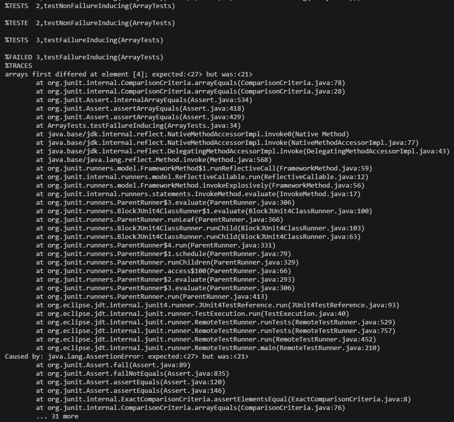

<!--
  Lab Report 3 for CSE 15L
  Winter 2023 Quarter
-->

# Lab Report 3
### Jefferson Umanzor

---

## Part One: Bugs

### Buggy Code

*Unchanged Buggy Code*

- The method above, `reverseInPlace`, intends to reverse the input `int[]` array in-place, i.e., without creating a new `int[]` array.
- The method traverses through the entire array using a `for` loop and replaces each index with its mirrored index.
- This causes a bug in the code, represented as such:
  -  Each index in the first half of the array is set to its mirrored index in the second half of the array and is consequently overwritten.
  -  Each index in the second half of the array is set to its mirrored index in the first half of the array. As the values in the first half of the array are now overwritten, the second half of the array remains unchanged.
  -  Thus, the code results in the second half of the array being mirrored onto the first half.

### Test Cases for Buggy Code

*Failure Inducing Input*

- The code above displays a JUnit test for the buggy `reverseInPlace` method.
- This is a failure-inducing test, which will showcase the bug in the method.
- The method, `testFailureInducing` creates an `int[]` array `input` with the values `[27, 19, 0, 19, 21]` and calls `reverseInPlace` with the array, testing for an expected output of `[21, 19, 0, 19, 27]` using `assertArrayEquals`, which compares the values of two arrays.
- However, due to the bug in `reverseInPlace`, which mirrors the second half of the array onto the first half of the array, `input` is changed into `[21, 19, 0, 19, 21]`. Thus, the code is not reversed and the effect of the bug is displayed.

*Non-Failure-Inducing Input*

- The code above displays a JUnit test for the buggy `reverseInPlace` method.
- This is a non-failure-inducing test, which will not showcase the bug in the method.
- The method, `testNonFailureInducing` creates an `int[]` array `input` with the values `[27, 19, 0, 19, 27]` and calls `reverseInPlace` with the array, testing for an expected output of `[27, 19, 0, 19, 27]` using `assertArrayEquals`, which compares the values of two arrays.
- Due to the bug in `reverseInPlace`, which mirrors the second half of the array onto the first half of the array, `input` is changed into `[27, 19, 0, 19, 27]`. Thus, although the code is not reversed, the array `input` seems to be reversed because the first half of the array was already equal to the second half of the array.
- Therefore, when the second half of the array is mirrored onto the first half of the array, the values remain the same because they were equivalent and the effect of the bug is not displayed.

### JUnit Test Symptoms For Buggy Code

*JUnit Output*

- The image above displays the JUnit output for the tests in the methods `testFailureInducing` and `testNonFailureInducing` using the buggy `reverseInPlace` method.
- As described earlier, the non-failure-inducing test passes because the array, `input`, already has the values of the second half of the array mirrored onto the first half of the array.
- The test `testFailureInducing`, however, fails because the values in the second half of the array are not mirrored onto the first half of the array. Thus, the array `[27, 19, 0, 19, 21]` is expected to be reversed into `[21, 19, 0, 19, 27]`. However, the second half of the array is instead mirrored onto the first half of the array, resulting in the array `[27, 19, 0, 19, 27]`.
- Thus, the test results in a failed output in JUnit, which states: `arrays first differed at element [4]; expected:<27> but was:<21>`.

### Fix for Buggy Code

*Fixed Code*

- The method above is a fixed version of `reverseInPlace`, which intends to reverse the input `int[]` array in-place, i.e., without creating a new `int[]` array.
- The method traverses through the first half of the array using a `for` loop and saves the value at the index in an `int` variable, `temp`.
- The value at each of the indices in the first half of the array is then replaced with the value at its mirrored index, `arr.length - i - 1`.
- The value at the mirrored index, `arr.length - i - 1` is replaced with the value inside `temp`, swapping the values at index `i` and `arr.length - i - 1`.
- This fixed the previous bug in the code, reversing the values in the array instead of mirroring the second half of the array onto the first half.

## Part Two: Researching Commands

