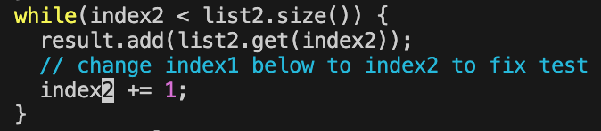

<!--
  Lab Report 4 for CSE 15L
  Winter 2023 Quarter
-->

# Lab Report 4
### Jefferson Umanzor

---

### `ieng6` Login

- In this screenshot, I `ssh` into `ieng6`. I typed in `ssh<space>jumanzorurrutia@ieng6.ucsd.edu` and clicked `<enter>` into my terminal and signed in without being prompted for a password. The corresponding output can be seen in the image above.

### Repository `clone`

- In this screenshot, I cloned my fork of the `lab7` repository. I used my `SSH clone URL` that I gained when adding my `ieng6` public key to my GitHub account. In my terminal, while inside `ieng6`, I typed `git<space>clone<space>git@github.com:umanzorurrutia/lab7.git` and clicked `<enter>`. This cloned the `lab7` repository into my `ieng6`.

### Testing Buggy Code
*Test for Buggy Code*

- In this screenshot, I ran the `lab7/test.sh` file while inside `lab7`. The `lab7/test.sh` file runs the tests inside `lab7/ListExamplesTests.java`. I ran the `lab7/test.sh` file by typing `cd<space>lab7` and clicking `<enter>` to cd into lab7 and then typing `bash<space>test.sh` and clicking `<enter>` to run the file. The output above displays an error due to a bug in the code inside the `lab7/ListExamples.java` file.

### Fixing Buggy Code
*Buggy Code*

- This screenshot displays the buggy code in the `lab7/ListExamples.java` file. To reach this screen, I typed `vim<space>ListExamples.java` and clicked `<enter>` while inside `lab7`. My cursor began at the bottom of the file. To reach the bug, I clicked `<up><up><up><up><up><up>` and `<right><right><right><right><right><right><right><right><right><right><right>`. This took me to the number `1` in `index1` under the comment `// change index1 below to index2 to fix the test`.

*Fixed Code*

- To fix the code from the previous position, I clicked `x` which deleted the `1` in `index1`, changing it to `index`. To insert a 2, I clicked `i` and `2` which entered me into insert mode, and typed in the number 2, changing `index` to `index2`. I clicked `<esc>` which reverted me to normal mode and typed `:wq` and clicked `<enter>` to save the file and exit `vim`. The fixed code is shown in the image above.

### Testing Fixed Code
*Test for Fixed Code*

- In this screenshot, I ran the `lab7/test.sh` file while inside `lab7`. The `lab7/test.sh` file runs the tests inside `lab7/ListExamplesTests.java`. I ran the `lab7/test.sh` file by typing `cd<space>lab7` and clicking `<enter>` to cd into lab7 and then typing `bash<space>test.sh` and clicking `<enter>` to run the file. The output above displays that all tests passed after fixing the bug in the code inside the `lab7/ListExamples.java` file.

### Commiting to `git`

- To commit and push my changes to the lab7 repository on GitHub, I did the following:
  -I typed `git<space>add<space>ListExamples.java` and clicked `<enter>` which marks the changes in `lab7/ListExamples.java` to be pushed into GitHub.
  - I then typed `git<space>commit<space>-m<space>"Commit<space>for<space>lab<space>report"` and clicked `<enter>` to commit the changes made in the `lab7/ListExamples.java` file. `-m<space>"Commit<space>for<space>lab<space>report"` adds the message in quotes to my commit.
  - Lastly, I typed `git<space>push<space>origin` and clicked `<enter>` which pushed my change from my local repository to the remote repository on GitHub.
- The sequence can be seen in the image above.
