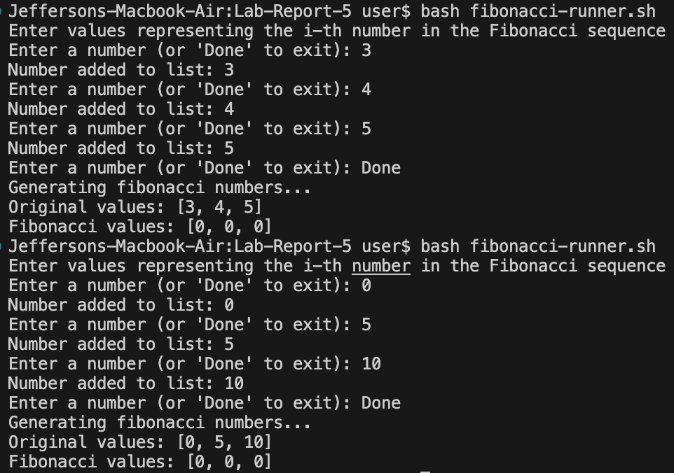
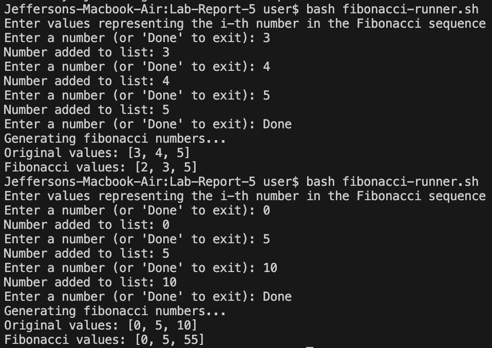

<!--
  Lab Report 5 for CSE 15L
  Winter 2023 Quarter
-->

# Lab Report 5
### Jefferson Umanzor

---

## Initial Student Bug Post
Hi Everyone,

I'm currently working on a program implementing a recursive Fibonacci sequence. However, I've encountered a peculiar issue with my code, and I could use some guidance.

Here's the problem: my Fibonacci program consistently returns 0, even when the numbers in the input file (representing the i-th Fibonacci number) are not all zeros. I have double-checked my code, but I'm unable to identify the source of the problem. I would greatly appreciate it if someone could provide some insight into what might be causing this unexpected behavior.

I've added some screenshots of the symptoms below.



Thank you all!

## TA Response
Hello [Student],

Thank you for reaching out for assistance with your recursive Fibonacci program. I understand the challenge you're facing and appreciate your proactive approach to debugging.

Let's focus on a few  aspects that might be contributing to the unexpected behavior:
- Base Case Handling: Ensure that your base case (when `value` is less than or equal to 1) is returning the expected values. This is crucial for the recursion to stop appropriately and return the proper value.
- Recursive Calls: Verify that you are calling the Fibonacci function correctly within your recursive calls. Ensure that each instance `value` is correctly passed, and there are no issues with the recursion chain.

Hope this helps!

## Corrected Student Post
Hi [TA],

Thank you for your prompt and helpful response. I've thoroughly examined your suggestions and am happy to report that I have successfully identified and resolved the issue with my recursive Fibonacci program.

Upon revisiting the base case as you recommended, I discovered a small oversight that was causing the unexpected behavior. When the value passed into the function was 0 or 1, it would return 0 instead of the value itself. Thus, once each number hit the base case, it would return 0, and the original value would recursively add 0. By correcting this, the program now produces the correct Fibonacci sequence values for each input.

I've attached some screenshots of the working symptoms below.



Thank you again for your help!

## Setup Information
### File and Directory Structure
```
+-- Lab-Report-5
|   +-- Fibonacci.java
|   +-- fibonacci-runnner.sh
```

## File Contents With Bug
### Fibonacci.java
```
import java.io.IOException;
import java.nio.file.Files;
import java.nio.file.Path;

public class Fibonacci {
    public static void main(String[] args) {
        // Create values[] from values.txt
        int[] values = arrayFromFile("values.txt");
        // Print each value
        System.out.print("Original values: [");
        for (int i = 0; i < values.length; i++) {
            if (i == values.length - 1) { System.out.println(values[i] + "]"); }
            else { System.out.print(values[i] + ", "); }
        }
        // Get the fibonacci of each value
        int[] fibonacci_values = new int[values.length];
        for (int i = 0; i < values.length; i++) { 
            fibonacci_values[i] = fibonacci(values[i]); 
        }
        // Print each fibonacci number
        System.out.print("Fibonacci values: [");
        for (int i = 0; i < values.length; i++) {
            if (i == values.length - 1) { System.out.println(fibonacci_values[i] + "]"); }
            else { System.out.print(fibonacci_values[i] + ", "); }
        }
    }

    // Create values from the provided file
    private static int[] arrayFromFile(String fileName) {
        try {
            Path filePath = Path.of(fileName);
            int[] values = Files.lines(filePath).mapToInt(Integer::parseInt).toArray();
            return values;
        } catch (IOException e) {
            System.out.println("Error reading the file: " + e.getMessage());
            return null;
        }
    }

    private static int fibonacci(int value) {
        if (value == 0 || value == 1) {
            return 0; // Error
        }
        return fibonacci(value - 1) + fibonacci(value - 2);
    }
}
```

### fibonacci-runner.sh
```
# Clear values.txt
if [ -f "values.txt" ]; then
    rm values.txt
    touch values.txt
fi

echo "Enter values representing the i-th number in the Fibonacci sequence"

# Input numbers into values.txt
while true; do
    read -p "Enter a number (or 'Done' to exit): " input

    # Convert the input to lowercase for case-insensitive comparison
    input_lower=$(echo "$input" | tr '[:upper:]' '[:lower:]')

    # Check if the user entered "done"
    if [[ "$input_lower" == "done" ]]; then
        echo "Generating fibonacci numbers..."
        break
    fi

    # Check if the input is a number
    if [[ "$input" =~ ^[0-9]+$ ]]; then
        echo "Number added to list: $input"
        echo $input >> values.txt
    else
        echo "Invalid input. Please enter a number or 'Done'."
        exit
    fi
done

# Compile and run the Java program
javac Fibonacci.java

if [ $? -ne 0 ]; then
    echo "Error with Fibonacci.java file"
fi

java Fibonacci
```

## Command Line Input To Trigger Bug
- To encounter the bug the first time, while inside the `Lab-Report-5/` directory, I typed `bash<space>factorial-runner.sh` and clicked `<enter>`. Then I clicked `3` and `<enter>`. Then I clicked `4` and `<enter>`. Then I clicked `5` and `<enter>`. Then I typed `Done` and clicked `<enter>`. The originals values were `[3, 4, 5]` and the output was `[0, 0, 0]`.
- To encounter the bug the second time, while inside the `Lab-Report-5/` directory, I typed `bash<space>factorial-runner.sh` and clicked `<enter>`. Then I clicked `0` and `<enter>`. Then I clicked `5` and `<enter>`. Then I clicked `10` and `<enter>`. Then I typed `Done` and clicked `<enter>`. The originals values were `[0, 5, 10]` and the output was `[0, 0, 0]`.

## Bug Fix
The bug was found inside the `fibonacci()` method in the `Fibonacci.java` file. The bug is as follows:
```
private static int fibonacci(int value) {
        if (value == 0 || value == 1) {
            return 0; // Error
        }
        return fibonacci(value - 1) + fibonacci(value - 2);
    }
```
- The bug is found in the base case. When `value` is 0 or 1, `value` should be returned. However, 0 is returned for both cases, causing an addition of zeroes.

The fixed code is shown below:
```
private static int fibonacci(int value) {
        if (value == 0 || value == 1) {
            return value; // Fixed error
        }
        return fibonacci(value - 1) + fibonacci(value - 2);
    }
```
The fixed code returns `value` when the `value` is equal to 0 or 1, inducing the proper function of the `fibonacci()` method.
